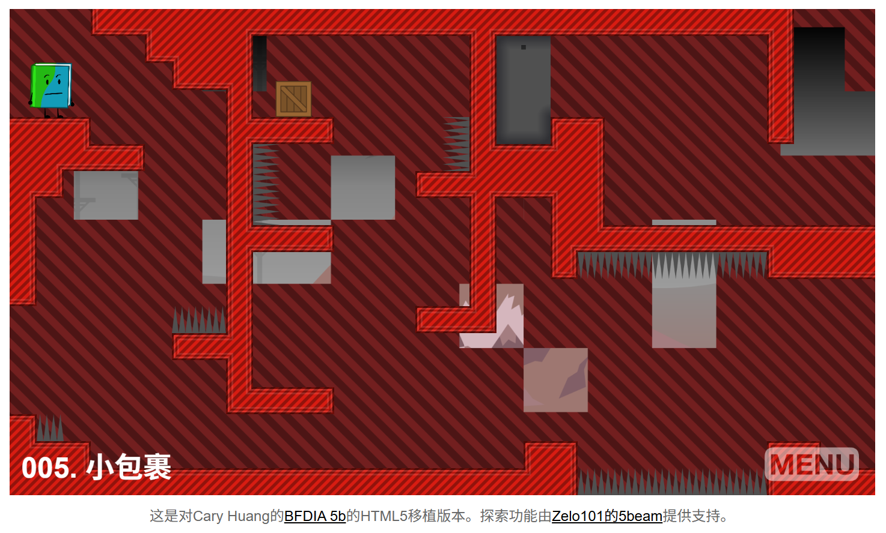

# HTML5b 梦岛之战
An HTML5 port of Cary Huang's flash game [BFDIA 5b](http://bfdi.tv/5b/) using only pureJS and HTML5. Everything relating to the gameplay has been implemented and the level creator has had all its major functionalities implemented. Once all the minor fixes are implemented; I will move on to adding the 5b level sharing platform called "Explore".  
这是一个使用纯JS和HTML5技术实现的Cary Huang的Flash游戏BFDIA 5b的HTML5版本。所有与游戏玩法相关的内容都已实现，关卡创建器的主要功能也已实现。一旦所有小的修复工作完成，我将开始添加名为"Explore"的5b关卡分享平台。

A lot of the code in here I didn't write. Since actionscript is so similar to javascript; a lot of the code was just copy-pasted from the decompiled swf with some minor reformatting.  
这里的很多代码并不是我写的。由于ActionScript与JavaScript非常相似，因此很多代码都是从反编译的swf文件中复制粘贴过来的，只做了一些小的格式调整。

> 这个项目只能使用https协议来访问。

- 原项目地址
  - 官网 https://coppersalts.github.io/HTML5b
  - GitHub仓库 https://github.com/coppersalts/HTML5b
- 我汉化和构建docker镜像的仓库
  - GitHub仓库 https://github.com/Firfr/html5b-zh
  - Gitee仓库 https://gitee.com/firfe/html5b-zh

## 汉化&修改&镜像制作

当前制作镜像版本(或截止更新日期)：2025年09月19日

首先感谢原作者的开源。  
原项目没有中文和docker镜像，我汉化和制作了docker镜像

具体汉化了那些内容，请参考[翻译说明](./翻译说明.md)。

只做了汉化和简单修改，有问题，请到原作者仓库处反馈。

欢迎关注我B站账号 [秦曱凧](https://space.bilibili.com/17547201) (读作 qín yuē zhēng)  

有需要帮忙部署这个项目的朋友,一杯奶茶,即可程远程帮你部署，需要可联系。  
微信号 `E-0_0-`  
闲鱼搜索用户 `明月人间`  
或者邮箱 `firfe163@163.com`  
如果这个项目有帮到你。欢迎start。

有其他的项目的汉化需求，欢迎提issue。或其他方式联系通知。

### 镜像

从阿里云或华为云镜像仓库拉取镜像，注意填写镜像标签，镜像仓库中没有`latest`标签

容器内部端口`5149`，可通过设置环境变量`SERVER_PORT`的值来指定监听端口。

```bash
swr.cn-north-4.myhuaweicloud.com/firfe/html5b:2025.09.19
```

部署完成后，需要使用https协议来访问。

游戏界面中的**探索**部分是需要联网的。

游戏难度随着关卡增加，😅第五关我就一直没有过去。

### docker run 命令部署

```bash
docker run -d \
--name html5b \
--network bridge \
--restart always \
--log-opt max-size=1m \
--log-opt max-file=1 \
-p 5149:5149 \
swr.cn-north-4.myhuaweicloud.com/firfe/html5b:2025.09.19
```

### compose 文件部署 👍推荐

```yaml
#version: '3'
name: html5b
services:
  html5b:
    container_name: html5b
    image: swr.cn-north-4.myhuaweicloud.com/firfe/html5b:2025.09.19
    network_mode: bridge
    restart: always
    logging:
      options:
        max-size: 1m
        max-file: '1'
    ports:
      - 5149:5149
```

### 效果截图

|  |  |
|-|-|

